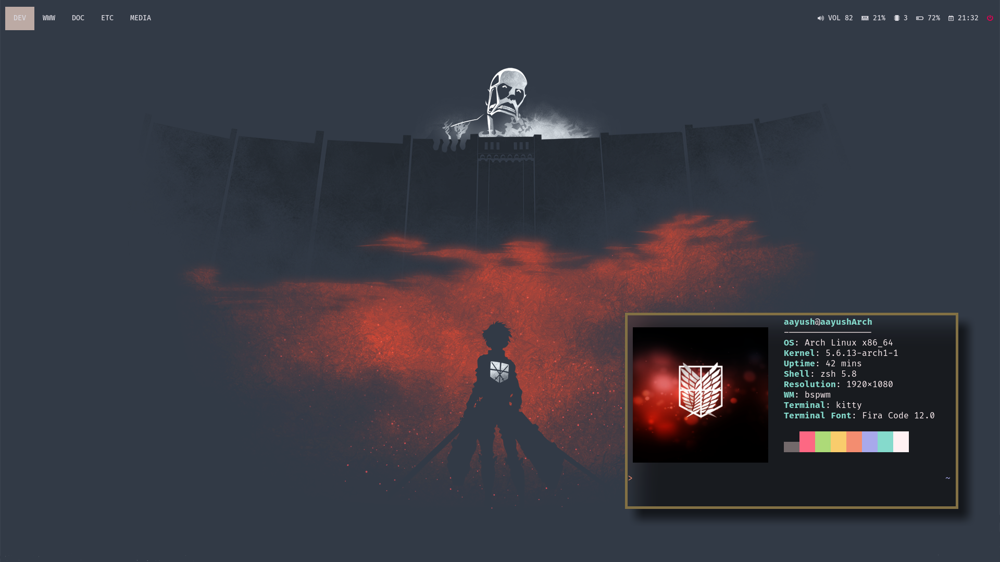
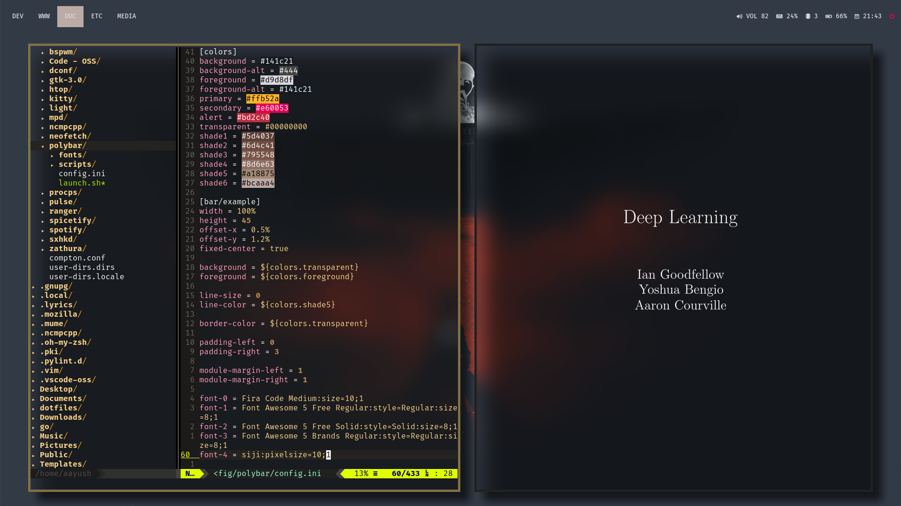
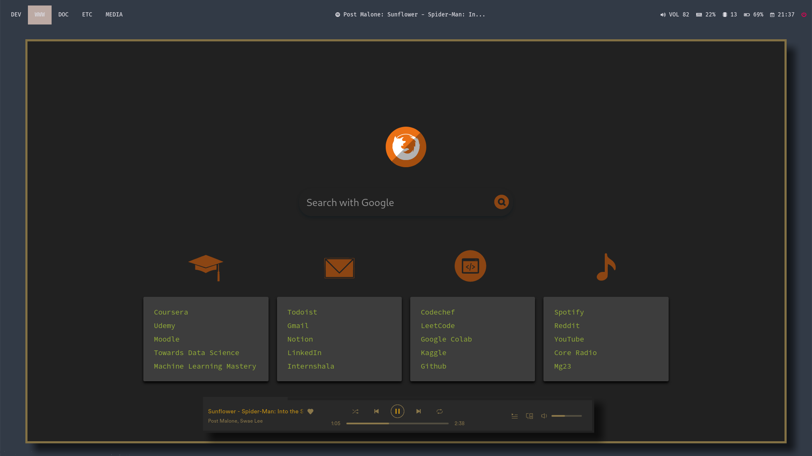

<!-- omit in toc -->
# DOTFILES FOR BSPWM
---

<!-- omit in toc -->
## Table of Content
- [System Information](#system-information)
- [Applications](#applications)
  - [Kitty](#kitty)
  - [Zsh](#zsh)
  - [Vim](#vim)
  - [Firefox](#firefox)
  - [Polybar](#polybar)
  - [Spotify](#spotify)
  - [Rofi](#rofi)
- [Sources Used](#sources-used)
- [Wallpaper](#wallpaper)

## System Information

| Category             | Application           |
| :------------------- | :-------------------- |
| WM                   | BSPWM                 |
| Terminal Emulator    | Kitty                 |
| Shell                | Zsh                   |
| Editor               | Vim                   |
| Browser              | Firefox               |
| Bar                  | Polybar               |
| Compositor           | Compton (tryone fork) |
| PDF Reader           | Zathura               |
| Music Player         | ncmpcpp               |
| File Browser         | ranger                |
| Application Launcher | Rofi                  |

## Applications 

### Kitty
* Colourscheme : [Monokai Pro (Filter Ristretto)](https://github.com/dexpota/kitty-themes/blob/master/themes/Monokai_Pro_(Filter_Ristretto).conf)
* Font : Fira Code

### Zsh
* Theme : [typewritten](https://github.com/reobin/typewritten)
  
### Vim

* Colourscheme : [badwolf](https://github.com/sjl/badwolf)
* Plugins :
    1. vim-airline
    2. syntanstic
    3. YouCompleteMe
    4. nerdtree
    5. vim-css-color
    6. vim-surround

### Firefox

* Colourscheme : Inspired From Kaapi Spotify theme

**Derived From**: [Prismatic Night](https://github.com/dbuxy218/Prismatic-Night)

### Polybar
* Edited the default config file
* Fonts : 
  * Fira Code
  * Font Awesome

### Spotify
* Colourscheme : [Kaapi](https://github.com/morpheusthewhite/spicetify-themes "Spicetify-themes") 

### Rofi
* Theme : [Materia](https://github.com/DefunctLizard/materia-rofi-theme)
* Font : Fira Code

## Sources Used

This was my very first attempt at ricing and thus, I needed help from a variety of sources. These are the sources that I borrowed heavily from. I based off my work from channel-42's dotfiles and gradualy as I got more comfortable, I started adding my own tweaks. While most the time reading the documentation or the man page or the Arch Wiki helped me, there were still times where I needed some inspiration as well as sources for ricing. Apart from the documentation of the vaious packagaes, these are the sources that helped me a lot.  

* BSPWM - https://github.com/channel-42/dotfiles
* BSPWM - https://github.com/LnLcFlx/dotfiles
* POLYBAR - https://github.com/adi1090x/polybar-themes
* POLYBAR - https://github.com/Jvanrhijn/polybar-spotify
* FIREFOX - https://github.com/dbuxy218/Prismatic-Night  

## Wallpaper

[Attack on Titan Wallpapaer](https://images4.alphacoders.com/607/607866.png)